# 🚀 AI-Powered TPRM Evidence Review Assistant (RiskLens AI)

**Product surface:** Streamlit experience branded **RiskLens AI** — an **AI-powered TPRM platform** for structured, evidence-bound third-party risk review.

The AI-Powered TPRM Evidence Review Assistant is a production-style cybersecurity assessment platform designed to automate **preliminary** vendor evidence review for **Third-Party Risk Management (TPRM)** workflows.

The system processes vendor evidence such as:

* SOC 2 reports
* Security questionnaires
* Security policies
* Audit documents
* Vendor compliance evidence

It extracts security-relevant information, identifies potential control gaps, classifies risks, generates recommendations, and produces structured cybersecurity assessment reports.

---

# 📌 Problem Statement

## Business problem

Traditional TPRM assessments are:

* Manual
* Time-consuming
* Repetitive
* Difficult to scale
* Prone to inconsistent analysis

Security analysts often review:

* SOC2 reports
* ISO evidence
* Vendor questionnaires
* DR/BCP documents
* Penetration test reports

This solution reduces manual effort by automating preliminary evidence review and identifying potential cybersecurity risks.

---

# 💡 Solution Overview

The platform is designed to:

* Automate evidence extraction
* Detect potential control gaps
* Validate questionnaire responses
* Assist security analysts
* Improve consistency
* Reduce review time
* Generate structured audit-style findings

The system processes vendor evidence such as:

* SOC 2 reports
* Security questionnaires
* Security policies
* Audit documents
* Vendor compliance evidence

It extracts security-relevant information, identifies potential control gaps, classifies risks, generates recommendations, and produces structured cybersecurity assessment reports.

---

# 🎯 Key Value Proposition

| Stakeholder | Value |
| ----------- | ----- |
| **Security / GRC** | Faster preliminary evidence triage with **severity**, **category**, **confidence**, and **actionable recommendations** aligned to audit-style language |
| **TPRM / Vendor risk** | Repeatable intake for SOC 2, questionnaires, and policies with structured JSON suitable for downstream workflow tooling |
| **Leadership** | Executive narrative plus quantified risk posture signals (dashboard metrics, distributions, exports) |

**Professional positioning:** The solution automates preliminary evidence review and assists analysts in identifying potential cybersecurity risks, reducing manual effort and improving assessment efficiency.

---

# 📸 Product screenshots

Visual tour of the **RiskLens AI** Streamlit experience. Assets live in [`Screenshots/`](Screenshots/) in this repository (paths are relative to the repo root so they render on GitHub).

### Dashboard home

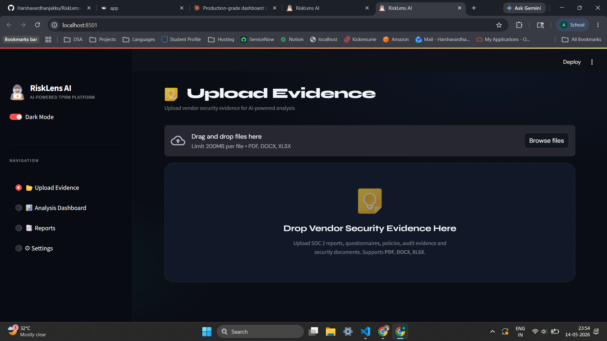

### Upload center

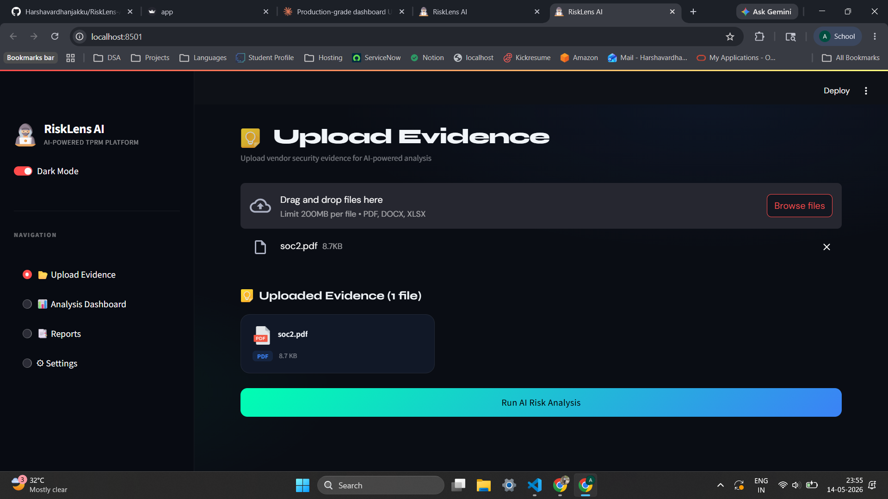

### Risk dashboard

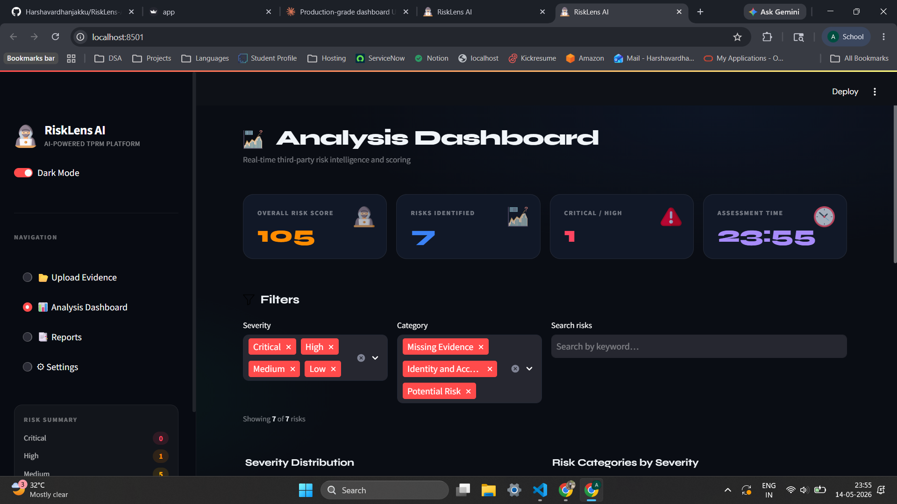

### Severity analysis

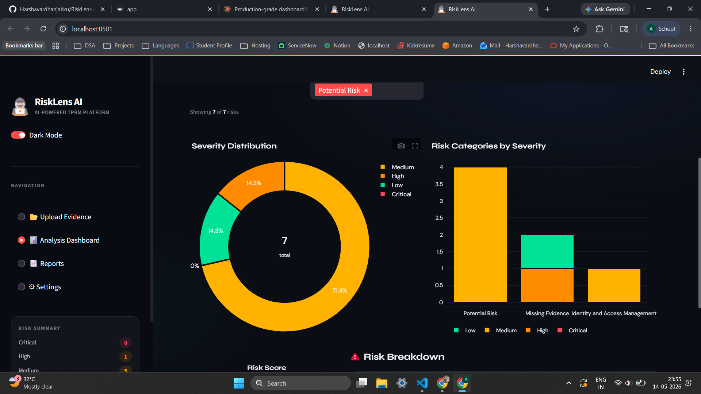

### Reports — section overview

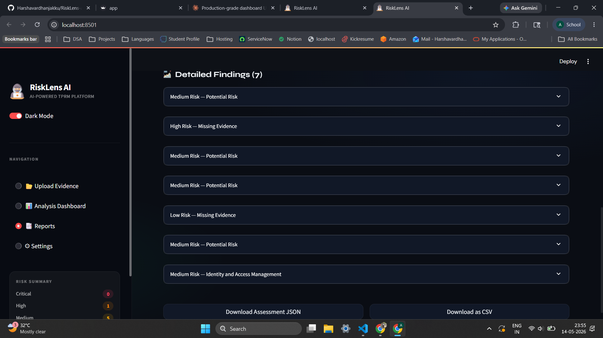

### Executive summary

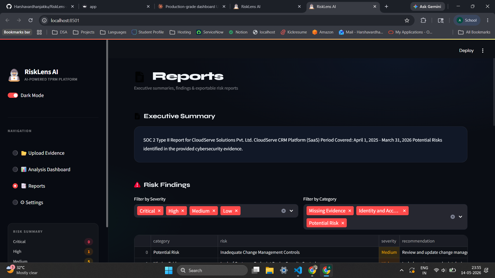

### Risk findings

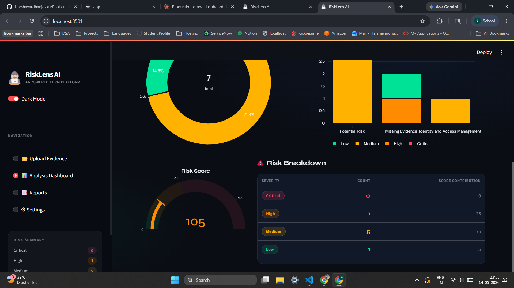

### Detailed findings

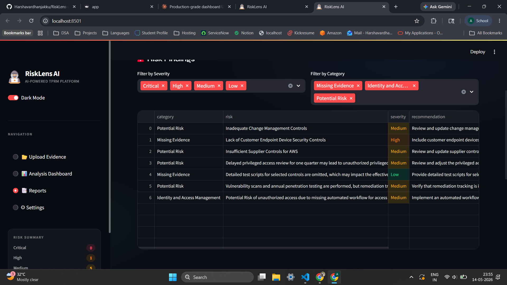

### SOC 2 analysis (demo)

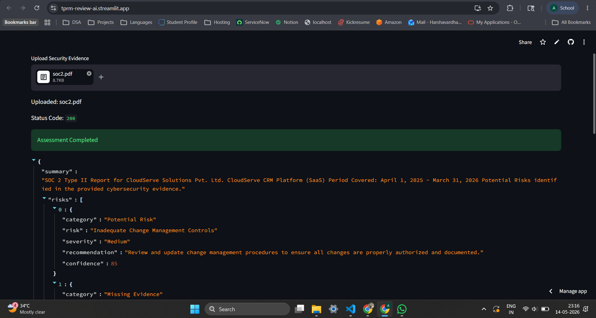

### Settings

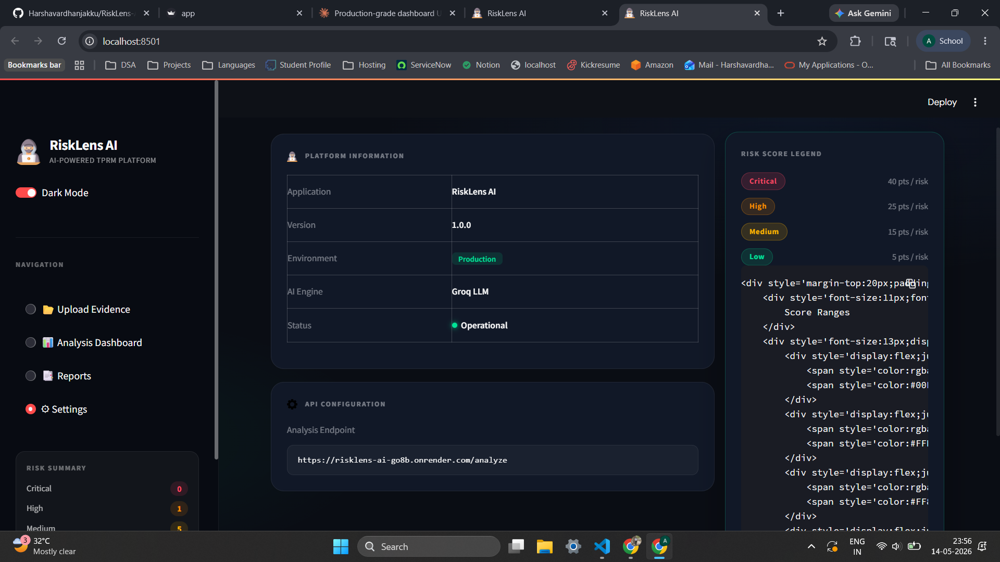

---

# 🧱 System Architecture

## Logical architecture (implementation-aligned)

The repository ships a **FastAPI** orchestration layer (`main.py`) that performs **file persistence → multi-format extraction → text hygiene → chunked LLM analysis → PDF report materialization**, alongside a **Streamlit** client (`app.py`) for interactive review. The demo client may call a **hosted** `POST /analyze` endpoint (see **API Configuration** in-app) or a **locally** run FastAPI instance per the runbook below.

### 1. Architecture diagram

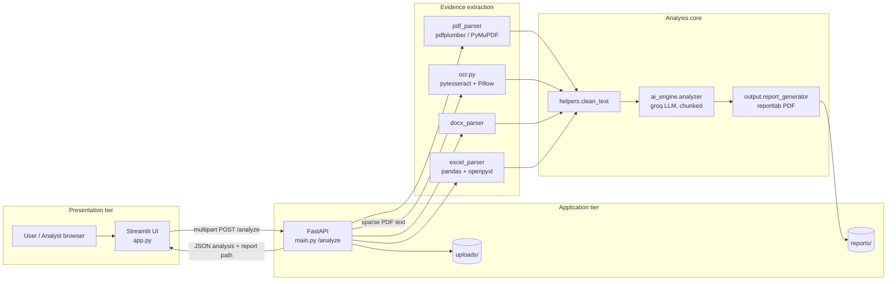

### 2. Module interaction (repository layout)

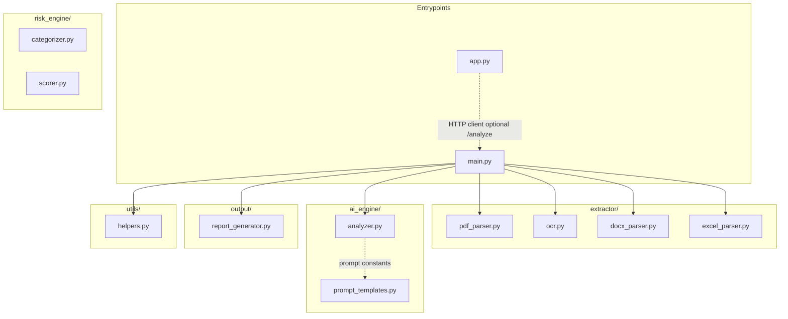

> **Note:** `risk_engine/` modules (`categorizer.py`, `scorer.py`) are part of the documented project structure and support **keyword- and heuristic-oriented** risk semantics; the **live** `/analyze` path in `main.py` delegates structured classification and narrative generation to the **Groq-backed** `ai_engine.analyzer` pipeline described under **AI Logic / Prompt Strategy**.

### 3. Preserved reference — original high-level system view

The following diagram is **retained verbatim** from the prior README (documentation continuity).

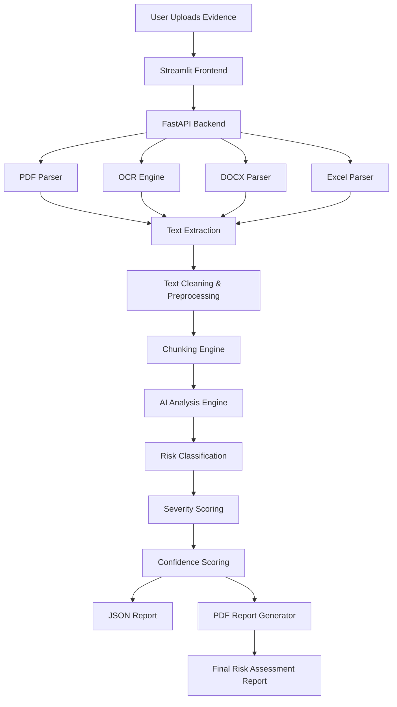

### 4. Preserved reference — original deployment view

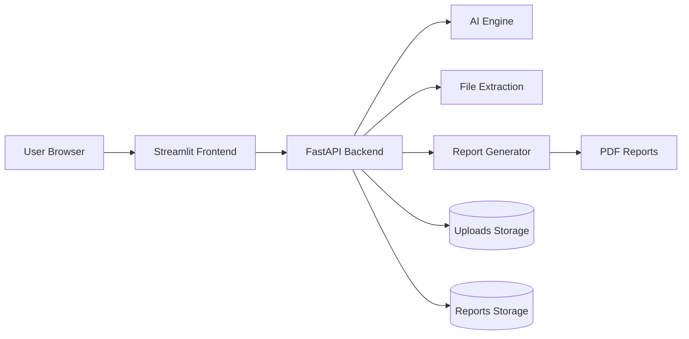

---

# 🔄 Workflow

## End-to-end sequence (preserved reference)

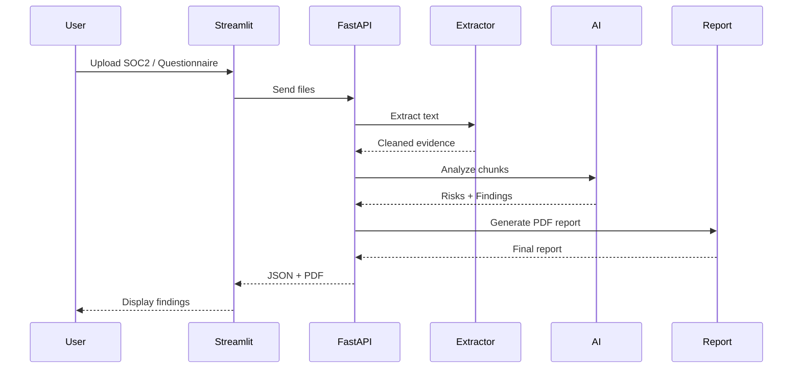

## Core processing pipeline

### Step 1 — File upload

Supported file formats:

* PDF
* DOCX
* XLSX

The frontend accepts multiple files simultaneously.

### Step 2 — Evidence extraction

#### PDF parsing

Uses:

* pdfplumber
* PyMuPDF

Capabilities:

* Extract machine-readable text
* Handle structured reports
* Read SOC2 evidence

#### OCR fallback

If PDF extraction fails:

* Convert pages to images
* Run OCR using pytesseract

This supports:

* scanned PDFs
* screenshots
* image-based evidence

#### Excel questionnaire extraction

The Excel parser extracts:

* security questionnaire answers
* MFA responses
* encryption details
* monitoring responses
* DR/BCP answers

Security-focused keyword filtering is used to reduce token usage.

## Example demo workflow

### Step 1

Upload:

* SOC2 report
* Questionnaire
* Security policy

### Step 2

System extracts:

* MFA evidence
* logging evidence
* backup controls
* incident response controls

### Step 3

AI identifies:

* delayed access review
* missing monitoring SLAs
* governance gaps
* DR visibility issues

### Step 4

System generates:

* executive summary
* risk table
* severity classifications
* recommendations

---

# 🔥 Core Features

## Core capabilities

* PDF / DOCX / XLSX upload
* OCR support for scanned PDFs
* AI-assisted cybersecurity evidence analysis
* Risk categorization engine
* Severity classification
* Confidence scoring
* Executive summary generation
* Human-readable PDF reports
* Streamlit demo dashboard
* FastAPI backend APIs
* Chunk-based document analysis
* Secure evidence-based assessment flow

## AI analysis engine

The AI engine performs:

* evidence review
* gap identification
* risk analysis
* recommendation generation
* severity assignment

## Chunk-based analysis

Large evidence documents are processed using chunking.

Benefits:

* Prevents token overflow
* Preserves full evidence coverage
* Improves scalability
* Reduces model failures

## Risk categories

The platform categorizes findings into:

| Category                 |
| ------------------------ |
| Access Control           |
| Data Protection          |
| Compliance               |
| Vulnerability Management |
| Incident Response        |
| Third-Party Risk         |
| Business Continuity      |
| Logging & Monitoring     |
| Governance               |

## Severity classification

Potential findings are assigned:

| Severity |
| -------- |
| Critical |
| High     |
| Medium   |
| Low      |

Severity is based on:

* evidence quality
* control weakness
* governance gaps
* operational inconsistency

## Confidence scoring

Confidence scores estimate:

* evidence reliability
* extraction quality
* AI certainty
* completeness of validation

Example:

```json
{
  "confidence": 88
}
```

## Example use cases

### TPRM assessments

* Vendor onboarding
* Vendor reassessment
* SaaS security review

### Compliance validation

* SOC2 review
* ISO evidence validation
* Security questionnaire review

### Internal security review

* Policy validation
* Security posture review
* Preliminary audit support

---

# ⚙️ Tech Stack

| Layer             | Technology           |
| ----------------- | -------------------- |
| Frontend          | Streamlit            |
| Backend API       | FastAPI              |
| AI Layer          | Groq LLM API         |
| OCR               | pytesseract          |
| PDF Parsing       | pdfplumber / PyMuPDF |
| DOCX Parsing      | python-docx          |
| Excel Parsing     | pandas + openpyxl    |
| Report Generation | reportlab            |
| Language          | Python               |

Additional libraries reflected in `requirements.txt` and UI: **requests**, **pandas**, **plotly**, **numpy**, **tqdm**, **python-multipart**, **python-dotenv**, etc.

---

# 📊 Data Flow

## Data flow diagram (evidence → assessment artifact)

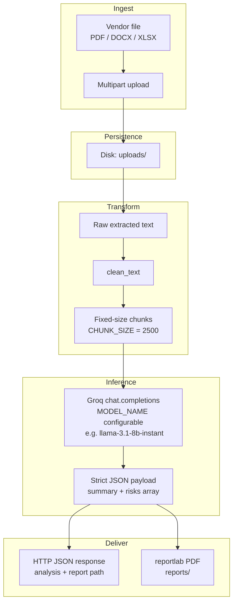

### API contract (documented)

## FastAPI endpoint

### Analyze evidence

```http
POST /analyze
```

### Input

Multipart file upload.

### Output

```json
{
  "analysis": {
    "summary": "...",
    "risks": []
  },
  "report": "reports/report.pdf"
}
```

---

# 🔐 Security & Risk Considerations

## Security assessment principles

The system follows safe cybersecurity reporting practices.

### The system NEVER says:

* "Vendor is insecure"
* "Confirmed breach"
* "Control failure confirmed"

### Instead it uses:

* "Potential Risk"
* "Missing Evidence"
* "Evidence could not verify"

## AI safety controls

The AI engine enforces:

* Evidence-only analysis
* Hallucination reduction
* Conservative wording
* Structured JSON outputs
* Deterministic processing

## Error handling

The system handles:

| Error               | Handling                |
| ------------------- | ----------------------- |
| Empty files         | Validation response     |
| Corrupt PDFs        | OCR fallback            |
| OCR failures        | Safe exception handling |
| Token overflow      | Chunk-based analysis    |
| Invalid AI response | JSON validation         |
| Missing evidence    | Conservative findings   |

## Testing strategy

### Functional testing

* PDF extraction validation
* OCR validation
* Excel parsing validation
* API endpoint testing
* Streamlit UI testing

### Security testing

* malformed file handling
* prompt injection prevention
* invalid file validation
* oversized document handling

---

# 🧠 AI Logic / Prompt Strategy

## Model and chunking (as implemented)

* **Provider:** Groq (`groq` Python SDK)
* **Chunking:** Fixed-width text segments (`CHUNK_SIZE = 2500` in `ai_engine/analyzer.py`) to bound prompt size and improve reliability on long evidence packs
* **Temperature:** `0` for reduced sampling variance
* **Output contract:** JSON-only responses; markdown code fences stripped when present before `json.loads`

## System prompt rules (analyzer)

The runtime system prompt requires:

* Only analyze provided evidence
* Never hallucinate
* Never say confirmed breach
* Use **Potential Risk** and **Missing Evidence** framing
* Return **STRICT JSON ONLY**

## Extended prompt template file (`prompt_templates.py`)

The repository also maintains an expanded `SYSTEM_PROMPT` that states:

1. ONLY analyze provided evidence.
2. NEVER hallucinate controls.
3. NEVER say:
   * Vendor is insecure
   * Confirmed breach
4. ALWAYS use:
   * Potential Risk
   * Missing Evidence
5. If evidence missing:
   Say:
   * "No evidence provided"

Your tasks:

* Identify gaps
* Detect potential risks
* Classify categories
* Assign severity
* Provide recommendations
* Estimate confidence score

Return STRICT JSON ONLY.

## Per-chunk user prompt shape

Each chunk is analyzed with instructions to return **only** valid JSON in the shape:

```json
{
  "summary": "...",
  "risks": [
    {
      "category": "...",
      "risk": "...",
      "severity": "...",
      "recommendation": "...",
      "confidence": 85
    }
  ]
}
```

## Aggregation behavior

* Per-chunk `summary` values are concatenated from the first summaries returned (implementation joins early summaries; see `analyze_text` in `ai_engine/analyzer.py`).
* Per-chunk `risks` arrays are **extended** into a consolidated risk list.
* If no risks survive parsing, a conservative default summary is returned with an empty risk array.

---

# 📂 Project Structure

```text
AI_TPRM_Evidence_Assist/
│
├── app.py
├── main.py
├── requirements.txt
├── README.md
│
├── extractor/
│   ├── pdf_parser.py
│   ├── ocr.py
│   ├── docx_parser.py
│   ├── excel_parser.py
│
├── ai_engine/
│   ├── analyzer.py
│   ├── prompt_templates.py
│
├── risk_engine/
│   ├── categorizer.py
│   ├── scorer.py
│
├── output/
│   ├── report_generator.py
│
├── utils/
│   ├── helpers.py
│
├── uploads/
├── reports/
├── data/
│   ├── frameworks.json
```

---

# 🧪 Example Input & Output

## Sample input files

Recommended test inputs:

* SOC2 Type II reports
* Vendor questionnaires
* Security policies
* Incident response plans
* Backup/DR evidence

## Example risk finding

```json
{
  "category": "Access Control",
  "risk": "Delayed privileged access review identified.",
  "severity": "Medium",
  "recommendation": "Implement automated quarterly access review workflows.",
  "confidence": 89
}
```

## Example assessment output

```json
{
  "summary": "Vendor demonstrates generally mature controls with several operational gaps requiring attention.",
  "risks": [
    {
      "category": "Access Control",
      "risk": "Delayed privileged access review identified.",
      "severity": "Medium",
      "recommendation": "Implement automated quarterly access review workflows.",
      "confidence": 89
    },
    {
      "category": "Logging & Monitoring",
      "risk": "Monitoring SLAs could not be validated.",
      "severity": "Medium",
      "recommendation": "Define alert response SLAs and ownership.",
      "confidence": 84
    }
  ]
}
```

---

# 🎮 Additional Features

## Streamlit dashboard

The frontend provides:

* file upload UI
* assessment status
* JSON viewer
* downloadable PDF report
* cybersecurity findings display

## Scalability design

The architecture supports future expansion:

* RAG pipelines
* vector databases
* NIST mapping
* ISO control mapping
* multi-tenant processing
* analyst workflow approvals
* RBAC
* cloud deployment

---

# ⚠️ Limitations & Risk Awareness

## Known constraints

* AI responses depend on evidence quality
* OCR accuracy varies by scan quality
* Incomplete evidence may reduce confidence
* Findings are preliminary and AI-assisted

## Compliance disclaimer

This solution is intended for:

* preliminary cybersecurity assessment
* evidence review assistance
* analyst productivity improvement

It is NOT intended to replace:

* formal audits
* certified assessments
* professional security validation

## Final disclaimer

This assessment is AI-assisted and intended for preliminary risk analysis only. Final validation should be performed by qualified cybersecurity professionals.

---

# 🚀 Future Enhancements

## Planned improvements

* LangChain integration
* Vector embeddings
* ChromaDB / Pinecone support
* Semantic search
* Risk heatmaps
* Dashboard analytics
* Workflow orchestration
* Analyst review queue
* Authentication & RBAC
* AWS deployment

---

# 📦 Deployment / Demo

## Installation

### Clone repository

```bash
git clone <repository-url>
```

### Create virtual environment

```bash
python -m venv venv
```

### Activate environment

#### Windows

```bash
venv\Scripts\activate
```

### Install dependencies

```bash
pip install -r requirements.txt
```

## Environment variables

Create `.env`

```env
GROQ_API_KEY=your_groq_api_key
```

## Running the backend

```bash
uvicorn main:app --reload
```

Backend:

```text
http://127.0.0.1:8000
```

Swagger Docs:

```text
http://127.0.0.1:8000/docs
```

## Running Streamlit

```bash
streamlit run app.py
```

Frontend:

```text
http://localhost:8501
```

---

## Appendix — preserved README mermaid (exact copies)

The following **end-to-end workflow** diagram is **retained verbatim** from the prior README.


